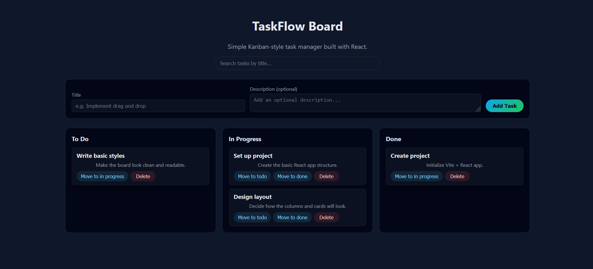

# TaskFlow Board

TaskFlow Board is a simple Kanban-style task management app built with React.  
It allows users to create tasks, organize them into columns (**To Do**, **In Progress**, **Done**), move tasks between columns (via buttons or drag-and-drop), search by title and persist data in the browser.

This project was created as part of my portfolio to demonstrate front-end skills with React, state management, drag-and-drop and a clean UI.

---
## Live Demo

[Open TaskFlow Board](https://danielmartinez2.github.io/taskflow-board/)

## Preview



## Features

-  Three default columns: **To Do**, **In Progress**, **Done**
-  Create new tasks with title and optional description
-  Move tasks between columns:
    - via action buttons (*Move to In Progress*, *Move to Done*, etc.)
    - via **drag-and-drop** between columns
-  Delete tasks
-  Search bar to filter tasks by title (in all columns)
-  Tasks are persisted in **localStorage** (the board state is kept after refresh)
-  Responsive layout (works on desktop and mobile)

---

## Tech Stack

- **Frontend:** React (Vite)
- **Language:** JavaScript (ES6+)
- **Styling:** CSS (custom)
- **State & Logic:**
  - React hooks (`useState`, `useEffect`)
  - Drag-and-drop using native HTML5 `draggable` API
  - LocalStorage for persistence

---

## Getting Started

### 1. Clone the repository

```bash
git clone https://github.com/DanielMartinez2/taskflow-board.git
cd taskflow-board
```
---

### 2. Install dependencies

```bash
npm install
```
---

### 3. Run the development server

```bash
npm run dev
```
---

## Project Structure
```bash
taskflow-board/
  ├─ src/
  │  ├─ components/
  │  │  ├─ Column.jsx        # Column component (To Do / In Progress / Done)
  │  │  └─ TaskCard.jsx      # Individual task card
  │  ├─ App.jsx              # Main app: state, handlers, layout
  │  ├─ main.jsx             # React entry point
  │  └─ styles.css           # Global styling
  ├─ index.html
  ├─ package.json
  └─ README.md
```

---

## License
 This is a project for personal portfolio and educational purposes